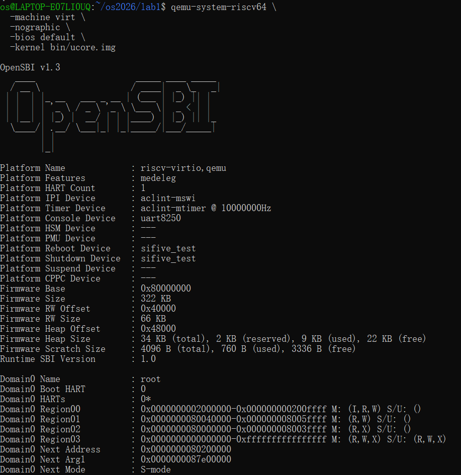
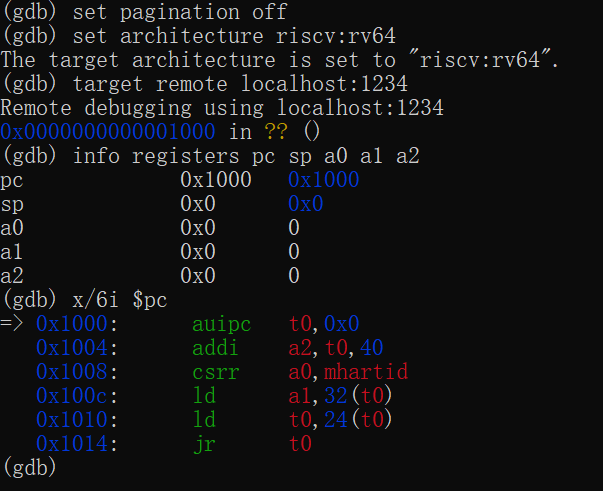
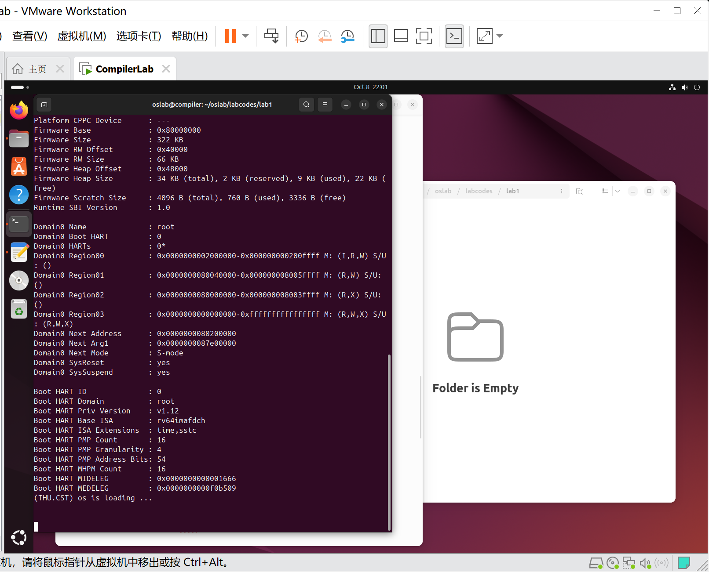
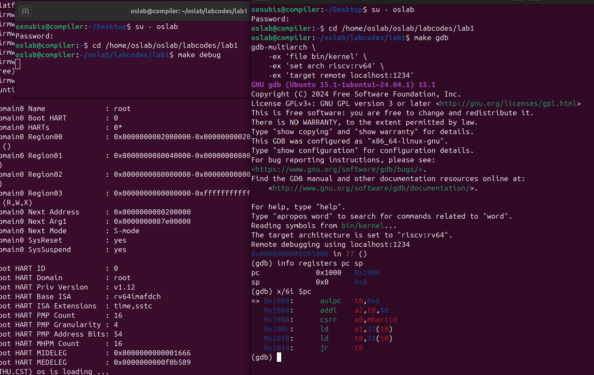
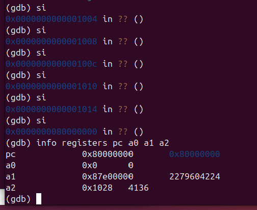
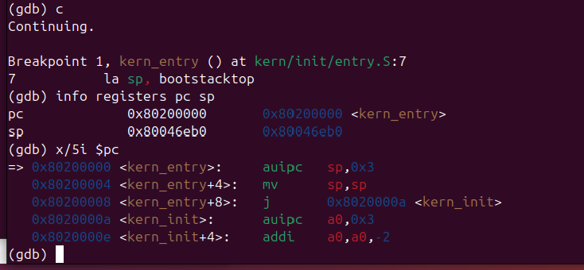
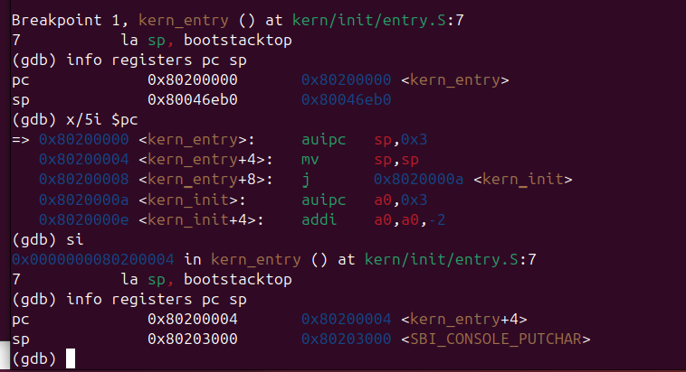
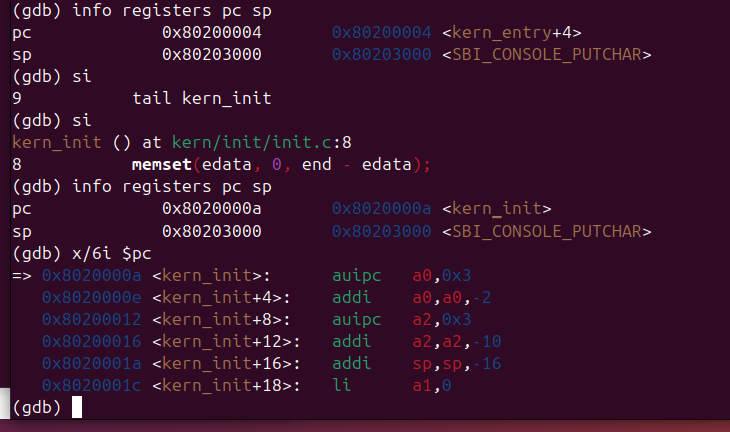
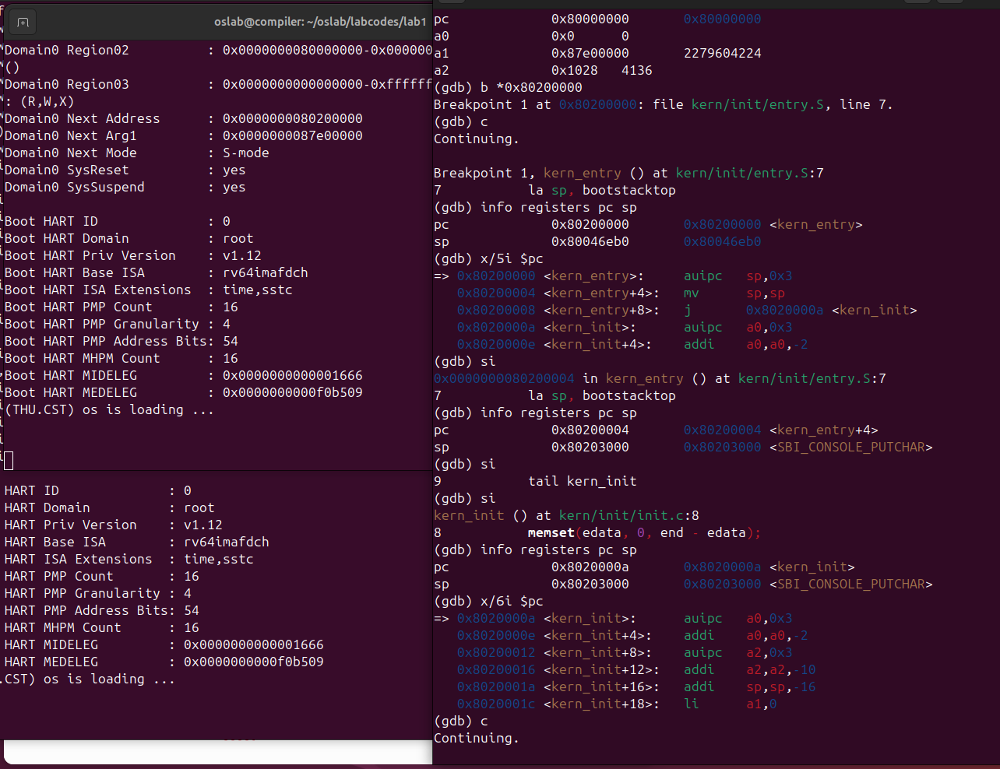
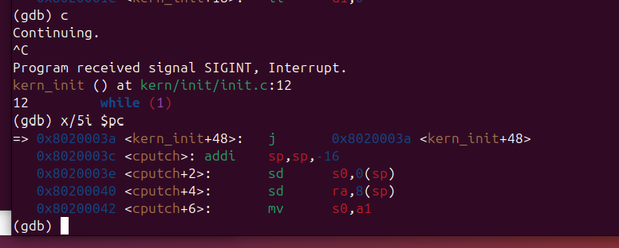

# 操作系统实验报告

> 合并稿：A 原有分析已保留，B 实测材料已补齐，C 调试材料及部分成员信息待补充。本文件尚不是完整提交版。


## 实验基本信息

| 项目 | 内容 |
| --- | --- |
| 实验名称 | Lab1：比麻雀更小的麻雀（最小可执行内核） |
| 小组成员 | 单馨淼 孙若晴 华轩宁 |
| 完成日期 | B 调试完成于 2026-10-08；整体完成日期待填写 |

### 小组分工

| 成员 | 实验分工 | 报告分工 |
| --- | --- | --- |
| 华轩宁 | 练习 1：入口指令、内核栈和相关源码分析 | 练习 1 |
| 孙若晴 | 练习 2 前半段：复位入口到 OpenSBI | 六条指令分析、寄存器变化及截图 |
| 单馨淼 | 练习 2 后半段：进入内核及运行验证 | 入口断点、pc/sp 变化和运行截图 |


## 一、实验目的

1. 编译并运行一个最小的 RISC-V 内核，理解机器从复位、执行固件到进入内核的过程。
2. 理解内核入口处设置栈指针、跳入 C 函数的作用。
3. 使用 AI 工具检查项目文件、辅助源码分析，以代码依据和编译运行结果核对解释。

## 二、实验环境

| 成员 | AI 编程工具 | 底层模型 | 实际用途 |
| --- | --- | --- | --- |
| 华轩宁 | Codex | GPT-6.1 Sol | 阅读入口代码、分析栈定义与伪指令 |
| 孙若晴 | Codex | GPT-6.1 Sol | 环境搭建、解释 GDB 指令、核对单步结果 |
| 单馨淼 | Chat GPT | GPT-6 高级 | 环境指导、总体规划 |

## 三、实验整体逻辑分析

### 3.1 本实验的逻辑主线

解决的问题：怎样让编译好的内核在模拟的机器上开始执行，建立运行代码所需的基本环境，并输出一条启动信息。

```text
QEMU 装载固件及内核映像
  → CPU 执行复位入口代码
  → 执行 OpenSBI
  → 进入 0x80200000 的 kern_entry
  → 设置内核栈指针
  → 跳到 kern_init
  → 清零 BSS、打印启动文字、进入无限循环
```


### 3.2 各部分为什么按此顺序执行

1. 首先搭建环境，理清启动流程。
准备编译工具和 QEMU，了解 CPU 如何经过 OpenSBI 进入内核。先完成这些，才能明确内核的运行条件和启动方式。
2. 接着生成内核镜像，建立运行环境。
通过链接脚本确定内存布局和入口，编译生成镜像；启动后设置栈、进入 kern_init 并清零 BSS 区域。这些工作保证内核能在正确位置执行，并正常运行 C 代码。
3. 最后实现输出，验证启动过程。
利用 OpenSBI 服务打印启动信息，再用 GDB 设置断点、单步跟踪，确认内核成功启动，并核对各个启动环节。


## 四、实验内容与实现

### 4.1 练习 1：理解内核启动中的程序入口操作

**负责人：华轩宁**

#### 需要实现/修改的函数：
无。本练习分析 kern/init/entry.S 中的 kern_entry 汇编入口，重点理解 la sp, bootstacktop 和 tail kern_init 的作用与目的。

源文件 `kern/init/entry.S` 的核心代码为：

```asm
kern_entry:
    la sp, bootstacktop
    tail kern_init
```

#### `la sp, bootstacktop` 的操作与目的

`la sp, bootstacktop`将启动栈的上界地址`bootstacktop`放入栈指针寄存器`sp`，完成内核栈指针的初始化。

目的是为接下来的内核代码准备好运行环境。因为`RISC-V`的栈是向低地址增长的，所以要把`sp`指针指向预留栈空间的高地址边界`bootstacktop`。不设置内核自己的栈，就会继续依赖固件遗留的栈指针，无法保证后续栈操作使用的是内核预留的空间。


#### `tail kern_init` 的操作与目的

 `tail kern_init` 将执行流程跳转到 C 语言编写的内核初始化函数 `kern_init`，且不设置新的返回地址。
 
 其目的是在设置好栈后，转入 C 代码继续完成内核初始化。由于 `kern_init` 不会返回，因此不需要保存返回汇编入口的地址。


### 4.2 练习 2 前半段：从复位入口到 OpenSBI

**负责人：孙若晴**

#### 环境与编译运行

本部分在 Windows 的 WSL2 Ubuntu-24.04 中完成。实际工具版本为 GNU Make 4.3、riscv64-unknown-elf-gcc 13.2.0、QEMU 8.2.2、GDB Multiarch 15.1，默认固件显示 OpenSBI v1.3。

在实验目录执行 `make` 后，成功生成 `bin/kernel` 和 `bin/ucore.img`。前者保留调试符号，供 GDB 使用；后者是供 QEMU 装载的原始内核映像。

最初执行 `make qemu` 时，仅看到 OpenSBI 输出，且 `Domain0 Next Address` 为 `0x0`，没有内核启动文字。原 Makefile 使用 `-device loader,file=bin/ucore.img,addr=0x80200000`；在本机组合中，这种方式未正确配置默认固件的内核下一跳。改用以下命令后，下一跳地址变为 `0x80200000`，并打印 `(THU.CST) os is loading ...`：

```bash
qemu-system-riscv64 -machine virt -nographic -bios default -kernel bin/ucore.img
```

以上是本机实际采用的运行方式；最终提交代码时应同步调整 Makefile 的 qemu/debug 目标并复测，或在项目说明中明确采用的命令。

#### 调试方法

使用两个终端，均进入 Ubuntu-24.04 的同一用户和实验目录。第一个终端运行：

```bash
qemu-system-riscv64 -machine virt -nographic -bios default -kernel bin/ucore.img -s -S
```

`-s` 开启默认端口 1234 的 GDB 服务，`-S` 使 CPU 在启动时暂停。第二个终端运行 `gdb-multiarch bin/kernel`，然后逐行输入：

```gdb
set pagination off
set architecture riscv:rv64
target remote localhost:1234
info registers pc sp a0 a1 a2
x/6i $pc
x/2gx 0x1018
```

连接后 PC 为 `0x1000`，`sp/a0/a1/a2` 均为零。使用 `si` 执行一条机器指令，再用 `info registers pc t0 a0 a1 a2` 记录结果，重复直到到达 `0x80000000`。

#### 最初六条指令的地址、功能与观测结果

| 地址 | 实际指令 | 操作及目的 |
| --- | --- | --- |
| `0x1000` | `auipc t0,0x0` | 当前指令地址加零，得到 `t0 = 0x1000`，供后续相对寻址使用 |
| `0x1004` | `addi a2,t0,40` | 计算 `0x1000 + 0x28`，使 `a2 = 0x1028`，作为传给固件的动态启动信息结构地址 |
| `0x1008` | `csrr a0,mhartid` | 从 CSR `mhartid` 读取硬件线程编号；本次单 hart 配置中结果为 0 |
| `0x100c` | `ld a1,32(t0)` | 从 `0x1020` 读取 64 位值 `0x87e00000`，作为设备树地址传入固件 |
| `0x1010` | `ld t0,24(t0)` | 从 `0x1018` 读取 64 位值 `0x80000000`，得到固件入口地址 |
| `0x1014` | `jr t0` | 跳转到 `0x80000000`，移交控制权给 OpenSBI |

直接检查内存得到：`0x1018` 存放 `0x80000000`，`0x1020` 存放 `0x87e00000`。这与两次 `ld` 的寄存器结果一致。`a1`、`a2` 的用途依据本实验的启动约定解释，本次未进一步解析设备树和动态启动信息结构的字段。

| 状态（执行后） | PC | t0 | a0 | a1 | a2 |
| --- | --- | --- | --- | --- | --- |
| 初始暂停 | `0x1000` | 未单独记录 | `0x0` | `0x0` | `0x0` |
| `auipc t0,0x0` | `0x1004` | `0x1000` | `0x0` | `0x0` | `0x0` |
| `addi a2,t0,40` | `0x1008` | `0x1000` | `0x0` | `0x0` | `0x1028` |
| `csrr a0,mhartid` | `0x100c` | `0x1000` | `0x0` | `0x0` | `0x1028` |
| `ld a1,32(t0)` | `0x1010` | `0x1000` | `0x0` | `0x87e00000` | `0x1028` |
| `ld t0,24(t0)` | `0x1014` | `0x80000000` | `0x0` | `0x87e00000` | `0x1028` |
| `jr t0` | `0x80000000` | `0x80000000` | `0x0` | `0x87e00000` | `0x1028` |

#### 调试截图



图 1：使用 `-kernel bin/ucore.img` 启动，显示 OpenSBI v1.3、固件基址 `0x80000000` 和下一跳地址 `0x80200000`。



图 2：GDB 连接后停在 `0x1000`，`sp/a0/a1/a2` 均为零，并显示最初六条指令。逐条执行后的寄存器变化保留在上表中。

#### 问题回答与小结

本次 QEMU virt 配置下，RISC-V 加电后的最初几条指令位于 `0x1000` 至 `0x1014`。它们建立相对寻址基准，准备硬件线程编号、设备树地址和固件动态启动信息地址，读取固件入口并跳转到 `0x80000000`。这些指令属于 QEMU 提供的复位引导代码；`0x80000000` 才是本次 OpenSBI 固件入口，二者不能混为一处。这里记录的地址是本次模拟平台的结果，不能推广为所有 RISC-V 硬件的固定复位地址。


### 4.3 练习 2 后半段：OpenSBI 到内核运行（C）

**负责人：单馨淼**

#### 4.3.1 与前半段的衔接、实验环境选择及准备

本小组在实验初期采用各成员独立搭建环境、分段调试的方式开展工作。4.1 节负责入口汇编与内核栈的源码分析；4.2 节由另一成员在 Windows 的 WSL2 Ubuntu 24.04 中跟踪复位代码，验证程序计数器（PC）从 `0x1000` 经复位跳板转移到 OpenSBI 入口 `0x80000000`。本节由成员 C 在另一套环境中继续验证 **OpenSBI 向内核交接控制权，以及内核入口的栈初始化和 C 函数运行**，构成同一条启动流程的后半段。

由于后续还有多个 Lab，考虑到各自 Ubuntu 版本与工具配置可能存在差异，故决定将后续实验环境集中到一台可供远程共享的 VMware Ubuntu 虚拟机，减少反复配置和环境差异。**当前这次 C 部分调试实际在该虚拟机中完成；此前成员在各自环境中取得的观测结果保留为独立记录，并未用虚拟机截图代替。** 这次环境调整针对的是实验平台与协作方式，研究对象仍然是同一份 Lab1 的 RISC-V 最小内核启动流程。

C 部分实际使用 VMware Workstation 17 Pro 中的 Ubuntu 环境，配置共享实验账户 `oslab`（具备 `sudo` 权限），实验目录为 `/home/oslab/oslab/labcodes/lab1`。安装并检查的主要工具如下：RISC-V GCC 13.2.0、GNU ld 2.42、GDB Multiarch 15.1、QEMU 8.2.2、GNU Make 4.3；启动固件输出 OpenSBI v1.3。源代码先复制到 `oslab` 的实验目录，并统一从该目录执行命令，避免图形桌面所用账户 `senubis` 与共享账户 `oslab` 的工作目录混淆。



图 3：成员 C 的 VMware 环境复测结果。OpenSBI 的下一阶段地址为 `0x80200000`，内核输出欢迎信息；本图与 4.2 节中 B 成员的 WSL2 截图属于不同环境下的独立实测。

#### 4.3.2 启动 GDB，复核复位入口与 OpenSBI 入口

在两个终端中分别进入同一 Lab1 目录。终端 A 执行 `make debug`，终端 B 执行 `make gdb`。前者使用 QEMU 的 `-s -S` 参数开启默认 GDB 端口 `1234` 并在复位位置暂停 CPU；后者调用 `gdb-multiarch`、加载 `bin/kernel` 的符号并连接到 `localhost:1234`。本次调试命令均在 GDB 提示符下一条一条执行。

```bash
# 终端 A
cd /home/oslab/oslab/labcodes/lab1
make debug

# 终端 B（另一个终端）
cd /home/oslab/oslab/labcodes/lab1
make gdb
```

连接后使用 `info registers pc sp` 和 `x/6i $pc` 查看执行位置，实测 `PC = 0x1000`、`SP = 0x0`，反汇编显示 `auipc`、`addi`、`csrr`、两条 `ld` 和 `jr` 共六条复位指令。连续单步执行六次 `si` 后，PC 到达 `0x80000000`，此时 `a0 = 0x0`、`a1 = 0x87e00000`、`a2 = 0x1028`。这与 4.2 节的启动阶段分析相衔接，说明接下来可以从 OpenSBI 继续验证内核入口。



图 4：成员 C 的 GDB 初始状态，PC 为 `0x1000`、SP 为 `0x0`，并显示前六条指令。



图 5：六次 `si` 之后 PC 到达 `0x80000000`，对应 OpenSBI 固件入口。

#### 4.3.3 在 `kern_entry` 设置断点，验证控制权进入内核

为了避免在固件内部逐条执行大量初始化指令，在 OpenSBI 入口处直接为内核第一条指令设置地址断点，然后恢复执行：

```gdb
b *0x80200000
c
info registers pc sp
x/5i $pc
```

GDB 实际命中 `Breakpoint 1, kern_entry () at kern/init/entry.S:7`，观测到 **`PC = 0x80200000`，`SP = 0x80046eb0`**。这表明 OpenSBI 已把执行权转交给 Lab1 的内核入口，而此时入口汇编还未将 SP 设置为内核预留栈顶。

此处的入口反汇编为：

```asm
0x80200000 <kern_entry>:    auipc sp,0x3
0x80200004 <kern_entry+4>:  mv    sp,sp
0x80200008 <kern_entry+8>:  j     0x8020000a <kern_init>
```

其中前两条机器指令对应源码中的 `la sp, bootstacktop`，第三条跳转指令对应 `tail kern_init`。4.1 节已经从源码角度解释它们的含义；本节继续检查这几条指令对寄存器的实际影响。



图 6：断点命中 `kern_entry`，GDB 显示入口 PC、尚未初始化的 SP，以及入口汇编指令。

#### 4.3.4 单步验证内核栈的建立

在 `0x80200000` 处执行一条 `si` 后，再次查询 `pc` 和 `sp`。GDB 显示 PC 前进到 `0x80200004`，**SP 由 `0x80046eb0` 改为 `0x80203000`**，与 `auipc sp,0x3` 在当前位置计算的值一致。再执行 `mv sp,sp`，SP 保持不变。继续执行跳转后进入 `kern_init`，此前设置的内核栈顶仍然保留。

| 观察时点 | PC | SP | 对应结论 |
| --- | --- | --- | --- |
| 命中 `kern_entry` 断点 | `0x80200000` | `0x80046eb0` | 尚未切换到内核预留栈 |
| 执行 `auipc sp,0x3` 后 | `0x80200004` | `0x80203000` | SP 已设置为 `bootstacktop` |
| 执行 `mv sp,sp` 后 | `0x80200008` | `0x80203000` | SP 不变，完成 `la` 展开指令 |
| 执行跳转进入 `kern_init` 后 | `0x8020000a` | `0x80203000` | 开始执行 C 初始化函数 |

根据 4.1 节分析的 `KSTACKPAGE = 2`、`PGSIZE = 4096`，内核预留了 `8192` 字节启动栈，其高地址边界为 `0x80203000`。本次对比表明：内核入口主动重置 SP，才能保证后续 C 函数使用自己的栈空间，而不继续依赖固件阶段留下的寄存器状态。



图 7：执行 `auipc sp,0x3` 后，PC 为 `0x80200004`，SP 已更新为 `0x80203000`。

#### 4.3.5 验证 `tail kern_init` 对控制流的影响

继续单步执行后，GDB 从 `entry.S` 转到 `kern/init/init.c:8`，显示正在执行 `kern_init()`，对应源码行 `memset(edata, 0, end - edata);`。当时记录到 **`PC = 0x8020000a`，`SP = 0x80203000`**；反汇编也显示该 PC 指向 `<kern_init>`。这直接验证了在建立内核栈后，`tail kern_init` 将程序控制流由汇编入口转入 C 初始化函数，且没有改变刚设置好的初始栈顶。



图 8：调试器停在 `kern/init/init.c:8`，显示 `kern_init` 的起始地址和仍为 `0x80203000` 的 SP。

#### 4.3.6 验证内核输出及最终循环

进入 `kern_init` 后继续执行 `c`，QEMU 终端输出 `(THU.CST) os is loading ...`，说明内核已经完成基本初始化，并能通过实验提供的输出路径打印文字。随后在 GDB 中按 `Ctrl+C` 中断运行，调试器停在 `kern/init/init.c:12`，源码为 `while (1)`。执行 `x/5i $pc` 得到当前指令：

```asm
0x8020003a <kern_init+48>: j 0x8020003a <kern_init+48>
```

它是跳向自身的指令，说明 CPU 正在内核的无限循环中执行。Lab1 的内核尚未进入后续调度或交互逻辑，此处持续运行属于代码设计的预期结果。



图 9：成员 C 的调试终端与 QEMU 输出，内核打印启动信息。



图 10：GDB 中断位置为 `kern/init/init.c:12`，当前指令在 `0x8020003a` 自跳转。

#### 4.3.7 本部分结论及记录归属

本次 C 部分调试沿着 **`0x1000`（QEMU 复位入口）→ `0x80000000`（OpenSBI 固件入口）→ `0x80200000`（`kern_entry`）→ `0x8020000a`（`kern_init`）→ `0x8020003a`（最终循环）** 的控制流进行，补充验证了 4.2 节尚未涉及的内核入口与运行阶段。GDB 对 PC、SP 和汇编跳转的实测，与 4.1 节的入口汇编解释相互印证，形成了从源码分析到运行验证的完整证据链。

这次重新搭建共享 VMware 环境，也发现内核镜像被装入内存与固件正确跳转到内核是两件需要分别验证的事。调试中使用 AI 辅助理解工具命令、排查启动参数与文件路径问题，但以上数据均以 QEMU/GDB 的实测输出和截图为依据。**本节 `c-*.png` 均为成员 C 在 VMware 环境中的记录；4.2 节 `b-01`、`b-02` 仍保留为 B 成员在 WSL2 环境下原本应提供的截图，不在这里替换或冒用。**

## 五、检查与基础运行


| 检查项 | 检查方法 | 结果与依据 |
|---|---|---|
| 栈空间是否预留 | 查看 `entry.S` | `.space KSTACKSIZE` 在 `bootstack` 与 `bootstacktop` 之间预留栈空间 |
| 栈大小 | 查看 `memlayout.h` 和 `mmu.h` | `KSTACKPAGE = 2`、`PGSIZE = 4096`，因此栈大小为 8192 字节 |
| 栈的地址范围 | 查看生成的 `obj/kernel.sym` | `bootstack = 0x80201000`，`bootstacktop = 0x80203000`，两者相差 `0x2000`，与 8192 字节一致 |
| `la` 的指令展开 | 查看生成的 `obj/kernel.asm` | 对应 `auipc sp,0x3` 和 `mv sp,sp`，计算得到目标栈顶地址 |
| `tail` 的跳转目标 | 查看 `obj/kernel.asm` | 对应 `j 0x8020000a <kern_init>`，与进入初始化函数的解释一致 |
| 初始化函数是否返回 | 查看 `init.c` | `kern_init` 有 `noreturn` 声明，且末尾执行 `while (1)` |


| 编译 | 在本机执行 `make` | 成功生成 `bin/kernel` 和 `bin/ucore.img` |
| 普通运行 | 使用 `-kernel bin/ucore.img` | 下一跳为 `0x80200000`，终端打印内核启动文字；OpenSBI 启动截图见 4.2|
| 复位到固件 | GDB 六次 `si` | 从 `0x1000` 跳转至 `0x80000000`|


## 六、实验总结与收获

### 6.1 实验知识与操作系统原理的联系

#### 练习一：
| 实验知识点 | 对应的 OS 原理 | 联系和体会 |
|---|---|---|
| 内核入口 `kern_entry` | 操作系统的启动过程 | 从代码层面验证了过程的具体表现形式，内核入口是启动流程进入内核代码的位置。 |
| `la sp, bootstacktop` 设置栈指针 | 内核栈与函数调用 | 内核作为运行在裸机上的基础软件，在执行高级语言代码前，要先预留内核栈空间，并将sp设置为栈顶地址，而不能依赖固件遗留的寄存器状态。 |
| `tail kern_init`转入初始化函数 | 启动阶段的控制流转移 | 这条指令将执行流程从汇编入口转交给`kern_init`，也就是正式从底层环境到了C语言 |

操作系统原理中重要、但本次实验没有实现的内容包括：进程与线程调度、中断和异常处理。

### 6.2 AI 协作记录与经验

练习一：
本次练习中，我主要利用AI辅助理解了源代码。提问时明确了练习范围、和不改任何文件的要求，并让AI每次只解释一小步。比起直接要求ai解释整个文件，还是自己先看一遍之后直接问不懂的地方更快一些，也更容易找到代码重点。


### 6.3 练习二前半段的原理联系

| 实验知识点 | OS 原理知识点 | 含义、联系与差异 |
| --- | --- | --- |
| 复位入口与固件入口 | 系统引导 | 复位代码准备固件运行参数并跳转；固件进一步准备内核运行条件。二者承担不同阶段，入口地址也不同 |
| a0/a1/a2 启动参数 | 软件层之间的接口约定 | 寄存器承载 hart 编号和地址；本次约定服务于启动过程，不能简单等同于普通 C 函数调用 |
| PC 与单步执行 | 指令执行与控制流 | PC 指示下一条执行指令，`si` 可观察顺序执行和跳转；这属于机器级控制流，不是进程调度 |
| QEMU 与 GDB | 系统软件的可观测性 | QEMU 模拟硬件，GDB 检查寄存器和内存；观测结果限于当前平台、固件和工具版本 |

本次未实现的重要 OS 内容还包括：虚拟内存和页表管理、用户态进程管理、系统调用处理、文件系统及设备驱动框架。虽然调用了固件控制台服务，但这不等同于实现完整的内核 I/O 子系统。

### 6.4 练习二前半段 AI 协作记录

AI 用于整理环境依赖、解释 GDB 操作、整理截图快速产生表格。
搭建过程中发现：未指定发行版的 `wsl` 会进入不同环境，单独搭建的环境要注意是什么；GDB 中多行指令被作为一条命令解释后，改为逐行执行。AI 提供的操作建议不一定正确，需要经过实际运行验证，人对运行的环境、代码内容等需要有清晰的认知和记忆，不能AI说什么就是什么。

### 6.5 练习二后半段的原理联系

| 实验知识点 | 对应的 OS 原理 | 联系和体会 |
|---|---|---|
| OpenSBI 向内核移交控制权 | 操作系统的引导与特权级 | OpenSBI 完成底层初始化后，将控制权交给 S-mode 下的内核。通过 GDB 观察到 PC 从固件阶段进入 `0x80200000`，验证了这一过程。 |
| 内核入口设置 SP | 内核栈与函数调用 | 进入内核时 SP 为 `0x80046eb0`，执行 `la sp, bootstacktop` 后变为 `0x80203000`，说明内核需要主动建立自己的栈环境，为后续 C 函数运行提供条件。 |
| `tail kern_init` | 启动阶段的控制流转移 | 单步执行后，PC 到达 `0x8020000a`，进入 `kern_init`，验证了汇编入口向 C 初始化函数的跳转。 |
| `kern_init` 的无限循环 | 内核初始化与运行状态 | 内核打印启动信息后，PC 停留在 `0x8020003a` 的自跳转指令，说明当前最小内核已完成预定初始化，但还没有实现进程调度等进一步功能。 |
| QEMU 与 GDB 配合调试 | 硬件模拟与底层程序调试 | QEMU 提供模拟的 RISC-V 硬件环境，GDB 用于观察指令执行、寄存器状态和程序控制流，使操作系统启动过程能够被具体地验证。 |

本次实验让我对操作系统启动的理解从源码分析进一步延伸到了实际执行过程。尤其是内核入口的栈初始化和向 C 函数的跳转，可以直接通过 PC、SP 的变化加以验证。

操作系统原理中重要、但本次实验没有实现的内容还包括：进程与线程调度、虚拟内存管理、系统调用，以及完整的中断和异常处理机制。

### 6.6 练习二后半段 AI 协作记录与经验

本部分主要使用 ChatGPT 辅助完成实验环境配置、Makefile 问题排查、GDB 调试指导及实验结果分析。AI 没有直接替我执行实验操作，最终记录的数据均来自实际运行的终端输出和 GDB 调试结果。

**环境准备方面**，考虑到后续还需要完成多个 Lab，并且三名组员的 Ubuntu 环境可能存在差异，我在 AI 辅助下选择了 VMware Ubuntu 共享虚拟机的方案，版本也选择了较高的版本（ Ubuntu 24.04 ）。通过创建 `oslab` 账户、配置管理员权限、安装 RISC-V 工具链，将后续实验统一到一套环境中。AI 主要帮助我理解 Linux 用户权限、目录结构以及软件安装方式。

**编译和运行方面**遇到了图形界面与终端使用不同 Linux 账户、修改了错误目录下的 Makefile 等问题，需要进一步根据实际文件路径纠正操作。

**协作经验方面**，AI 在提供操作指导时也出现过判断不准确的问题。例如，曾经未能及时区分不同用户目录下的代码副本，导致修改后的 Makefile 没有应用到实际运行的实验中。因此，我逐渐意识到，使用 AI 辅助底层系统实验时，需要明确当前账户、工作目录、程序状态以及已经执行过的操作。对于 AI 提出的原因分析，应当结合源码、编译结果和调试输出进行验证，不能直接当作实验结论。

总体而言，AI 在环境配置和调试排错中提供了帮助，尤其适合解释不熟悉的命令、提供排查方向和组织实验记录。但实验中真正关键的部分仍然是对执行环境的理解，以及通过 GDB 实测数据验证程序行为。本次实验也让我认识到，在后续更复杂的操作系统实验中，需要保持对实验状态和代码修改内容的独立判断。